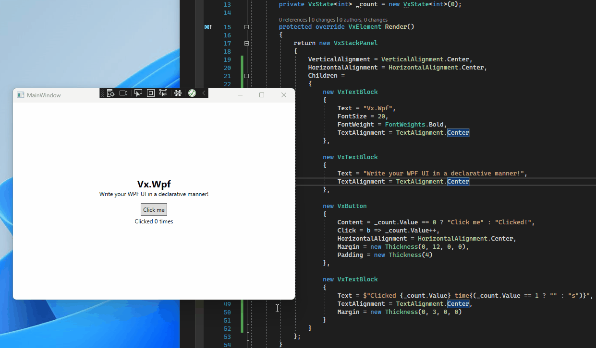
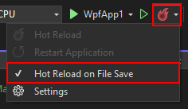
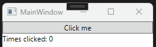
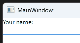
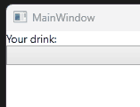
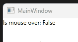

# Vx.Wpf - 🔥 Declarative WPF with hot reload 🔥



> ⚠️ This is an unmaintained hackathon project. Use at your own risk. It's open source, so fork the code and improve it!

Features | Descriptions
--|--
Supports all WPF controls | All properties are usable, classes are simply prefixed with `Vx`
Supports **third-party WPF controls**! | The code analyzer auto-generates Vx wrappers for all UI controls, including controls from third-parties
Supports **your own WPF controls**! | No need to do anything to your existing controls, just use them with the `Vx` prefix!
Can be integrated into any existing project | Any `VxComponent` can be rendered to a standalone classic UIElement by simply calling `ToUI()`.
Supports hot reload! | Everything within the `Render()` method supports hot reload!

## Get started

1. Install the [`Vx.Wpf`](https://www.nuget.org/packages/Vx.Wpf) NuGet package to your WPF project
2. Create your first `VxComponent`

```csharp
public class MyComponent : VxComponent
{
    protected override VxElement Render()
    {
        return new VxTextBlock
        {
            Text = "Hello world!"
        };
    }
}
```

3. Display your `VxComponent` by calling `ToUI()` to transform it to a standard WPF UIElement!

```csharp
public MainWindow()
{
    InitializeComponent();

    Content = new MyComponent().ToUI();
}
```

4. Try using hot reload! You can enable hot reload on file save by opening the hot reload menu next to the "Start" button. Then, make changes within your `Render()` methods, click save, and watch the UI update!



## Samples

Browse the samples folder to see more examples.

## Adding interaction

To make your components interactive, you have to add **state**. Each component's `Render()` method is essentially a function on top of the component's current state. And if the component's state values change, `Render()` will be called again and the UI will be updated with any changes that occured.



```csharp
public class MyComponent : VxComponent
{
    private readonly VxState<int> _count = new VxState<int>(0);

    protected override VxElement Render()
    {
        return new VxStackPanel
        {
            Children =
            {
                new VxButton
                {
                    Content = "Click me",
                    Click = b => _count.Value++
                },

                new VxTextBlock
                {
                    Text = $"Times clicked: {_count.Value}"
                }
            }
        };
    }
}
```

You can define infinitely many `VxState<T>` values.

## Handling text boxes

The next thing to learn is how to handle text boxes (and other similar controls). This is a little different than classic WPF, since your component's state must also hold the current text value. **Make sure to handle both the `Text` and the `TextChanged` properties as seen below.**



```csharp
public class MyComponent : VxComponent
{
    private readonly VxState<string> _name = new VxState<string>("");

    protected override VxElement Render()
    {
        return new VxStackPanel
        {
            Children =
            {
                new VxTextBlock
                {
                    Text = $"Your name: {_name.Value}"
                },

                new VxTextBox
                {
                    Text = _name.Value,
                    TextChanged = t => _name.Value = t.Text
                }
            }
        };
    }
}
```

This same pattern will follow for combo boxes, check boxes, and more.



```csharp
public class MyComponent : VxComponent
{
    private readonly VxState<string?> _drink = new VxState<string?>(null);

    protected override VxElement Render()
    {
        return new VxStackPanel
        {
            Children =
            {
                new VxTextBlock
                {
                    Text = $"Your drink: {_drink.Value}"
                },

                new VxComboBox
                {
                    ItemsSource = new string[] { "Tea", "Coffee" },
                    SelectedValue = _drink.Value,
                    SelectionChanged = c => _drink.Value = c.SelectedValue as string
                }
            }
        };
    }
}
```

## Handling other event handlers

Event handlers are currently all projected as `Action<T>` properties, where `T` is the native UI type.

```csharp
new VxTextBlock
{
    Text = "Is mouse over: " + _isMouseOver.Value,
    MouseEnter = (TextBlock t) => _isMouseOver.Value = true,
    MouseLeave = (TextBlock t) => _isMouseOver.Value = false
}
```



The event args from the event are currently NOT projected. Most events, like TextChanged or SelectionChanged simply require access to the raw UI element to get the current value, so support for passing through those event args haven't been added yet.

## How does it work?

1. Vx.Wpf uses C# source generators to generate, at runtime, `Vx*` wrappers for all of the WPF UI classes referenced in your project. This gives you `VxStackPanel`, `VxTextBlock`, and even `VxRandomThirdPartyControl` and more. All of the properties will be projected, including the event handlers projected as described above.
2. The `VxComponent` uses these `Vx*` classes for the **virtual UI tree**. The initial call to `Render()` returns the initial UI tree, and then subsequent calls to `Render()` will perform a delta of the previous UI tree with the new one. The wrapped `Vx*` components are essential to ensure there's no additional initialization time of creating a new `TextBlock` only to throw it away.

## How to build the NuGet package?

In VS, open the Vx.Wpf.sln, and then right click the `Vx.Wpf` project and click "Pack". It'll output a new NuGet package in the bin folder.
